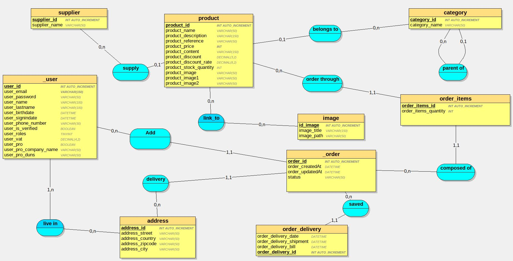

# Dictionnaire de données

## Table user
Codification | Type | Contraintes | Règles
---------|----------| ----------- | -----
 user_id | INT AUTO_INCREMENT  | PRIMARY KEY
 user_email | VARCHAR(150)
 user_password | VARCHAR(50)
 user_name | VARCHAR(100)
 user_lastname | VARCHAR(100)
 user_birthdate | DATETIME
 user_signupdate | DATETIME
 | |
 user_phonenumber | VARCHAR(30)
 user_isverified | BOOLEAN
 user_roles | LONGTEXT | | DC2Type:json
 user_vat | DECIMAL(4,2) 
 | |
 user_pro | BOOLEAN
 user_pro_company_name | VARCHAR(50) 
 user_pro_duns | VARCHAR(50) | | DUNS = SIRET international (Data universal number system) 

## Table Supplier
Codification | Type | Contraintes | Règles
---------|----------| ----------- | -----
 supplier_id | INT AUTO_INCREMENT | PRIMARY KEY
 supplier_name | VARCHAR(50)


## Table Category
Codification | Type | Contraintes | Règles
---------|----------| ----------- | -----
 category_id | INT AUTO_INCREMENT | PRIMARY KEY
 category_parent_id | INT | REFERENCES category(category_id)
 category_name | VARCHAR(50)


## Table address
Codification | Type | Contraintes | Règles
---------|----------| ----------- | -----
 address_id | INT AUTO_INCREMENT | PRIMARY KEY
 address_name | VARCHAR(50)
 address_country | VARCHAR(50)
 address_zipcode | VARCHAR(50)
 address_city | VARCHAR(50)
 address_address | VARCHAR(50)


## Table Product
Codification | Type | Contraintes | Règles
---------|----------| ----------- | -----
 product_id | INT AUTO_INCREMENT  | PRIMARY KEY
 product_supplier_id | INT  | REFERENCES supplier(supplier_id)
 product_category_id | INT |  REFERENCES category(category_id)
 product_name | VARCHAR(50) | | Ne pas oublier la brand dans le nom
 product_description | VARCHAR(150)
 product_price | INT
 product_content | VARCHAR(150)
 product_discount | DECIMAL(3,2)
 product_stock_quantity | INT | > 0 
 product_image | VARCHAR(50)

## Table Image
Codification | Type | Contraintes | Règles
---------|----------| ----------- | -----
image_id | INT | REFERENCES order_details(image_id)
image_product_id | INT |  REFERENCES product(product_id)
image_title |  VARCHAR(50)  
image_path | VARCHAR 


## Table order
Codification | Type | Contraintes | Règles
---------|----------| ----------- | -----
 order_id | INT AUTO_INCREMENT | PRIMARY KEY
 user_id | INT | REFERENCES user(user_id)
 address_id | INT|  REFERENCES address(address_id)
 order_createdAt | DATETIME
 order_status | VARCHAR(50)
 

## Table order_items
Codification | Type | Contraintes | Règles
---------|----------| ----------- | -----
 order_items_id | INT AUTO_INCREMENT | PRIMARY KEY
 order_items_product_id | INT | REFERENCES product(product_id)
 order_items_order_id | INT | REFERENCES order(order_id)
 order_details_quantity | INT


## Table order_delivery
Codification | Type | Contraintes | Règles
---------|----------| ----------- | -----
 order_delivery_id | INT AUTO_INCREMENT | PRIMARY KEY
 order_id | INT  | REFERENCES order(order_id)
 order_delivery_date | DATETIME
 order_delivery_shipment | DATETIME
  order_delivery_bill| DATETIME

## Table live_in
Codification | Type | Contraintes | Règles
---------|----------| ----------- | -----
user_id | INT | REFERENCES user(user_id)
adress_id | INT | REFERENCES address(address_id)


# MLD
```sql
_user = (user_id INT AUTO_INCREMENT, user_email VARCHAR(150) , user_password VARCHAR(50) , user_name VARCHAR(100) , user_lastname VARCHAR(100) , user_birthdate DATETIME, user_signindate DATETIME, user_phone_number VARCHAR(30) , user_is_verified BOOLEAN, user_roles TINYINT, user_vat DECIMAL(4,2)  , user_pro BOOLEAN, user_pro_company_name VARCHAR(50) , user_pro_duns VARCHAR(50) );
supplier = (supplier_id INT AUTO_INCREMENT, supplier_name VARCHAR(50) );
category = (category_id INT AUTO_INCREMENT, category_name VARCHAR(50) , #category_id_1*);
address = (address_id INT AUTO_INCREMENT, address_street VARCHAR(50) , address_country VARCHAR(50) , address_zipcode VARCHAR(50) , address_city VARCHAR(50) );
image = (image_id INT AUTO_INCREMENT, image_title VARCHAR(150) , image_path VARCHAR(50) );
product = (product_id INT AUTO_INCREMENT, product_name VARCHAR(50) , product_description VARCHAR(150) , product_reference VARCHAR(50) , product_price INT, product_content VARCHAR(150) , product_discount DECIMAL(3,2)  , product_discount_rate DECIMAL(8,2)  , product_stock_quantity INT, product_image VARCHAR(50) , product_image1 VARCHAR(50) , product_image2 VARCHAR(50) , #category_id*, #supplier_id*);
_order = (order_id INT AUTO_INCREMENT, order_createdAt DATETIME, order_updatedAt DATETIME, order_status VARCHAR(50) , #address_id, #user_id);
order_items = (order_items_id INT AUTO_INCREMENT, order_items_quantity INT, #order_id, #product_id);
order_delivery = (order_delivery_id INT AUTO_INCREMENT, order_delivery_date DATETIME, order_delivery_shipment DATETIME, order_delivery_bill DATETIME, #order_id);
live_in = (#user_id, #address_id);
link_to = (#product_id, #image_id);

```


# Script SQL
```sql
CREATE TABLE _user(
   user_id INT AUTO_INCREMENT,
   user_email VARCHAR(150)  NOT NULL,
   user_password VARCHAR(50) ,
   user_name VARCHAR(100) ,
   user_lastname VARCHAR(100) ,
   user_birthdate DATETIME,
   user_signindate DATETIME,
   user_phone_number VARCHAR(30) ,
   user_is_verified BOOLEAN,
   user_roles TINYINT UNSIGNED,
   user_vat DECIMAL(4,2)  ,
   user_pro BOOLEAN,
   user_pro_company_name VARCHAR(50) ,
   user_pro_duns VARCHAR(50) ,
   PRIMARY KEY(user_id)
);

CREATE TABLE supplier(
   supplier_id INT AUTO_INCREMENT,
   supplier_name VARCHAR(50) ,
   PRIMARY KEY(supplier_id)
);

CREATE TABLE category(
   category_id INT AUTO_INCREMENT,
   category_name VARCHAR(50) ,
   category_id_1 INT,
   PRIMARY KEY(category_id),
   FOREIGN KEY(category_id_1) REFERENCES category(category_id)
);

CREATE TABLE address(
   address_id INT AUTO_INCREMENT,
   address_street VARCHAR(50) ,
   address_country VARCHAR(50) ,
   address_zipcode VARCHAR(50) ,
   address_city VARCHAR(50) ,
   PRIMARY KEY(address_id)
);

CREATE TABLE image(
   image_id INT AUTO_INCREMENT,
   image_title VARCHAR(150) ,
   image_path VARCHAR(50) ,
   PRIMARY KEY(image_id)
);

CREATE TABLE product(
   product_id INT AUTO_INCREMENT,
   product_name VARCHAR(50) ,
   product_description VARCHAR(150) ,
   product_reference VARCHAR(50) ,
   product_price INT NOT NULL,
   product_content VARCHAR(150) ,
   product_discount DECIMAL(3,2)  ,
   product_discount_rate DECIMAL(8,2)  ,
   product_stock_quantity INT,
   product_image VARCHAR(50) ,
   product_image1 VARCHAR(50) ,
   product_image2 VARCHAR(50) ,
   category_id INT,
   supplier_id INT,
   PRIMARY KEY(product_id),
   FOREIGN KEY(category_id) REFERENCES category(category_id),
   FOREIGN KEY(supplier_id) REFERENCES supplier(supplier_id)
);

CREATE TABLE _order(
   order_id INT AUTO_INCREMENT,
   order_createdAt DATETIME,
   order_updatedAt DATETIME,
   order_status VARCHAR(50) ,
   address_id INT NOT NULL,
   user_id INT NOT NULL,
   PRIMARY KEY(order_id),
   FOREIGN KEY(address_id) REFERENCES address(address_id),
   FOREIGN KEY(user_id) REFERENCES _user(user_id)
);

CREATE TABLE order_items(
   order_items_id INT AUTO_INCREMENT,
   order_items_quantity INT NOT NULL,
   order_id INT NOT NULL,
   product_id INT NOT NULL,
   PRIMARY KEY(order_items_id),
   FOREIGN KEY(order_id) REFERENCES _order(order_id),
   FOREIGN KEY(product_id) REFERENCES product(product_id)
);

CREATE TABLE order_delivery(
   order_delivery_id INT AUTO_INCREMENT,
   order_delivery_date DATETIME,
   order_delivery_shipment DATETIME,
   order_delivery_bill DATETIME,
   order_id INT NOT NULL,
   PRIMARY KEY(order_delivery_id),
   FOREIGN KEY(order_id) REFERENCES _order(order_id)
);

CREATE TABLE live_in(
   user_id INT,
   address_id INT,
   PRIMARY KEY(user_id, address_id),
   FOREIGN KEY(user_id) REFERENCES _user(user_id),
   FOREIGN KEY(address_id) REFERENCES address(address_id)
);

CREATE TABLE link_to(
   product_id INT,
   image_id INT,
   PRIMARY KEY(product_id, image_id),
   FOREIGN KEY(product_id) REFERENCES product(product_id),
   FOREIGN KEY(image_id) REFERENCES image(image_id)
);

```

# MCD
