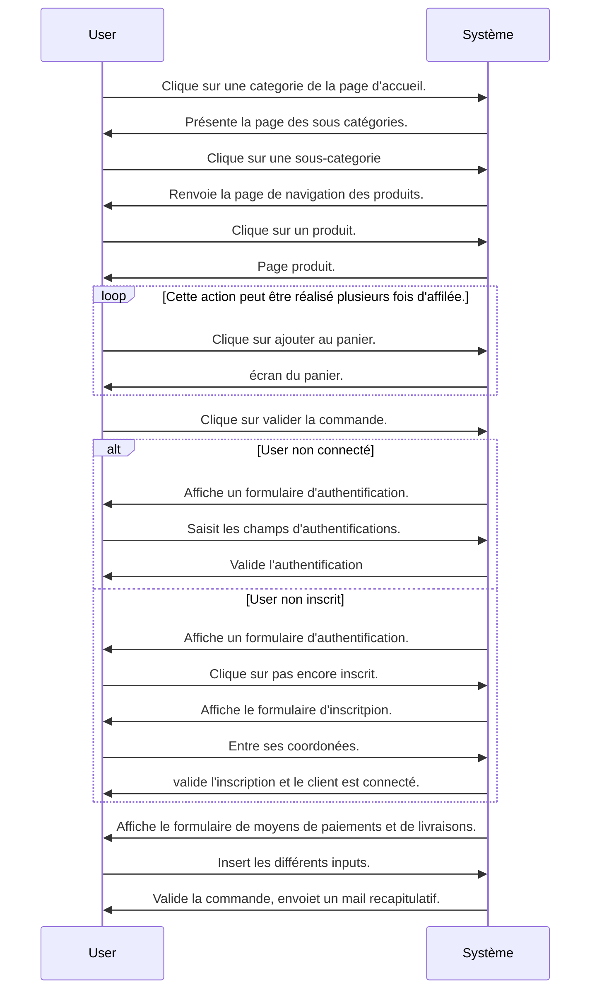

```mermaid

sequenceDiagram
participant User
participant Système

User->>Système: Clique sur une categorie de la page d'accueil.
Système->>User: Présente la page des sous catégories.
User->>Système: Clique sur une sous-categorie
Système->>User: Renvoie la page de navigation des produits.
User->>Système: Clique sur un produit.
Système->>User:  Page produit.
loop Cette action peut être réalisé plusieurs fois d'affilée.
User->>Système:  Clique sur ajouter au panier.
Système->>User: écran du panier.
end
User->>Système: Clique sur valider la commande.
alt User non connecté 
Système->>User: Affiche  un formulaire d'authentification.
User->>Système: Saisit les champs d'authentifications.
Système->>User: Valide l'authentification
else User non inscrit
Système->>User: Affiche un formulaire d'authentification.
User->>Système: Clique sur pas encore inscrit.
Système->>User: Affiche le formulaire d'inscritpion.
User->>Système: Entre ses coordonées.
Système->>User: valide l'inscription et le client est connecté.

end


Système->>User: Affiche le formulaire  de moyens de paiements et de  livraisons.
User->>Système: Insert les différents inputs.
Système->>User: Valide la commande, envoiet un mail recapitulatif.


``` 